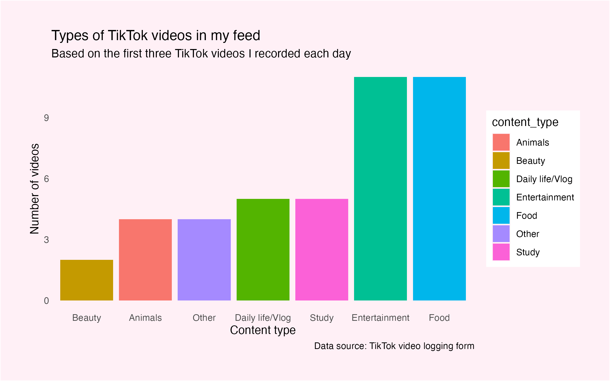
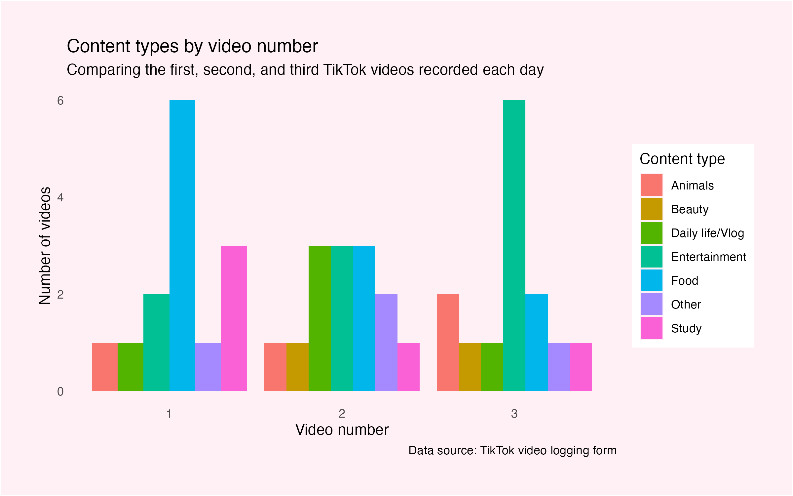
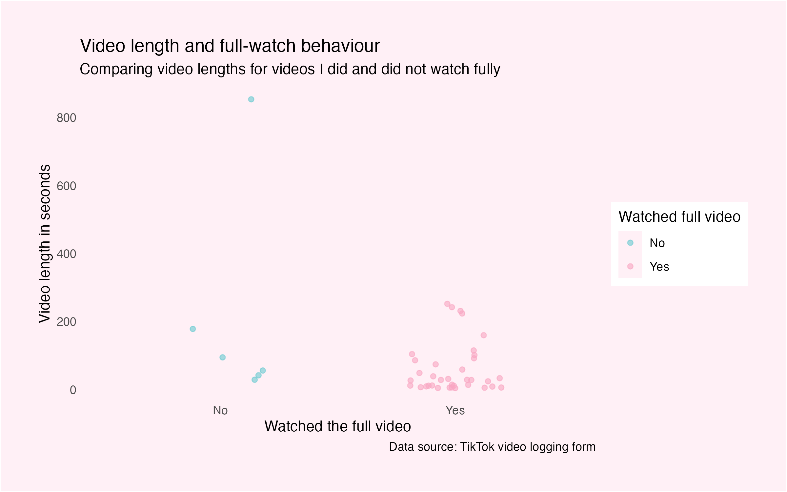
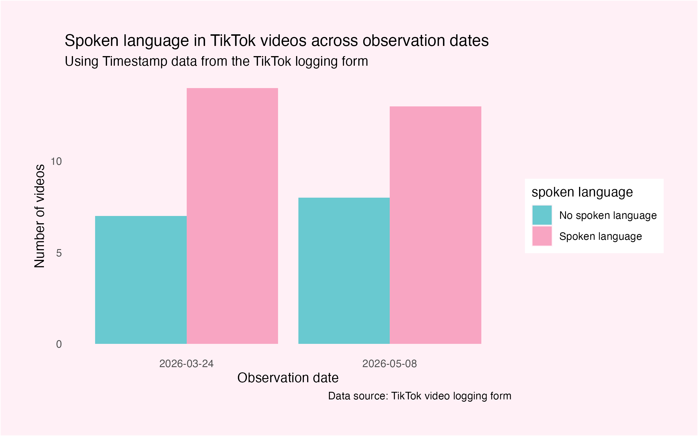

```{css, echo=FALSE}
body {
  background-color: #FFF0F6;
  color: #010101;
  font-family: Arial, sans-serif;
}

h1, h2 {
  color: #EE6FA7;
}

p {
  font-size: 18px;
  line-height: 1.6;
}

```
<script src="https://code.jquery.com/jquery-3.7.1.min.js" integrity="sha256-/JqT3SQfawRcv/BIHPThkBvs0OEvtFFmqPF/lYI/Cxo=" crossorigin="anonymous"></script>

```{r setup, include=FALSE}
knitr::opts_chunk$set(echo=FALSE, message=FALSE, warning=FALSE, error=FALSE)
```

```{js}
$(function() {
  $(".level2").css('visibility', 'hidden');
  $(".level2").first().css('visibility', 'visible');
  $(".container-fluid").height($(".container-fluid").height() + 300);
  $(window).on('scroll', function() {
    $('h2').each(function() {
      var h2Top = $(this).offset().top - $(window).scrollTop();
      var windowHeight = $(window).height();
      if (h2Top >= 0 && h2Top <= windowHeight / 2) {
        $(this).parent('div').css('visibility', 'visible');
      } else if (h2Top > windowHeight / 2) {
        $(this).parent('div').css('visibility', 'hidden');
      }
    });
  });
})
```

```{css}
.figcaption {display: none}
```

## What types of TikTok videos appeared in my feed?
This visual data story looks at the first three TikTok videos I see each day. I want to understand which types of videos appear most often on my TikTok feed and whether there are any clear patterns in the videos TikTok recommends to me.

This bar chart shows the types of videos that TikTok most frequently recommended to me, based on my recorded observations. This is useful for the rest of the visual data story because it shows the main content categories in my feed.
The chart suggests that food and entertainment videos appeared equally often and were the most common content types in my TikTok feed. This suggests that my recommendations were not dominated by only one category, but were mainly centred around casual and enjoyable content.

## Did the first, second, and third videos show different content patterns?
Because I recorded the first three TikTok videos I saw each day, I wanted to compare whether the type of video was related to its position in my feed. For example, I wanted to see whether the first video recommended to me was more likely to be the type of content I usually enjoy watching.

This bar chart compares the content types of the first, second, and third TikTok videos I recorded each day. It helps me understand whether TikTok recommended similar types of content across the three video positions, or whether certain content types appeared more frequently as the first, second, or third video.
The chart suggests that content type did not have a completely fixed pattern across the first, second, and third video positions, but some categories appeared more often in certain positions. This helps show that the order of recommendations may vary, rather than always showing the same type of video first.

## Were shorter videos easier to watch fully?
Another question I wanted to explore was whether watching a full video was related to video length. For example, I wanted to see whether I was more likely to finish shorter videos, or whether my full-watch behaviour depended more on my personal interests.



This jitter plot compares video length with whether I watched the full video. The plot shows that most fully watched videos were relatively short, although video length was not the only factor because some longer videos were also watched fully. This suggests that my full-watch behaviour may be influenced by both video length and personal interest. One very long video in the “No” group stretches the y-axis, and it also suggests that very long videos may be harder to watch completely.

## Did spoken language change across observation dates?

I also wanted to see whether the videos I recorded used spoken language or had no spoken language across different observation dates.



This bar chart shows how many videos used spoken language or had no spoken language on each observation date. It helps me see whether this pattern stayed similar across days, or whether some days included more videos without spoken language.
The chart shows that videos with spoken language appeared on most observation dates, while videos with no spoken language appeared less consistently. This suggests that spoken language was a common feature of the TikTok videos in my observations, but the pattern still changed slightly across different days.